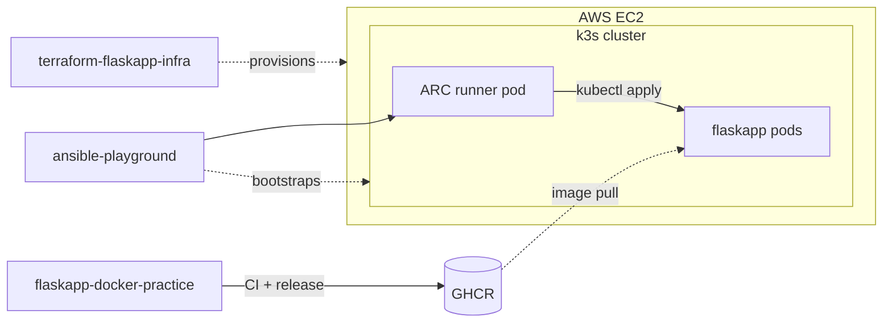

# flaskapp-docker-practice

[](https://github.com/prsmalley/flaskapp-docker-practice/actions/workflows/ci.yml)
[](https://github.com/prsmalley/flaskapp-docker-practice/actions/workflows/release.yml)
[](LICENSE)

**Status:** **Live at https://flaskapp.prsmalley.dev/health** — public HTTPS via Cloudflare Tunnel running on the EC2. The EC2 itself stays SG-restricted to the operator IP for SSH and the K8s API.

This repo owns the container image pipeline: six-job CI with security scanning, multi-arch builds, and post-publish vulnerability scans. It's one of three repos that together build, provision, and deploy a Flask app to a k3s cluster on AWS EC2:

- **flaskapp-docker-practice** — builds and publishes the container image to GHCR.
- **[terraform-flaskapp-infra](https://github.com/prsmalley/terraform-flaskapp-infra)** — provisions the EC2 host.
- **[ansible-playground](https://github.com/prsmalley/ansible-playground)** — bootstraps k3s and deploys the app via ephemeral self-hosted runners (ARC) running inside the cluster.

See [ARCHITECTURE.md](https://github.com/prsmalley/ansible-playground/blob/main/ARCHITECTURE.md) for the full design.



## Repo layout

```
flaskapp/
  app.py             # Flask app: /health, /greet?name=X, /version
  requirements.txt   # Pinned Python deps
  Dockerfile         # Multi-stage, slim base, non-root user, healthcheck
compose-app/
  app.py             # Same app, plus a Redis-backed /counter
  docker-compose.yml # Flask + Redis with a named volume (local dev only)
  Dockerfile         # Identical to flaskapp/
.github/workflows/
  ci.yml             # Lint, scan, test, build verification on every PR
  release.yml        # Multi-arch build + push to GHCR + post-publish scan
```

## Quick start (local development)

### Single container

```bash
cd flaskapp
docker build -t flaskapp:local .
docker run --rm -p 5000:5000 flaskapp:local
```

### Compose stack (with Redis)

```bash
cd compose-app
docker compose up -d --build
curl http://localhost:5000/counter
```

`/counter` increments a Redis-backed counter and persists across container
restarts. `docker compose down -v` wipes state.

**Note:** the Compose stack is a local-dev artifact demonstrating Compose
patterns (service discovery via embedded DNS, named volumes, `depends_on`
semantics). This image is never published to GHCR. Production deploys a single container; multi-service
orchestration is the job of Kubernetes downstream.

## Endpoints

### `flaskapp/` — production image (deployed to K8s)

| Endpoint | Description |
|---|---|
| `/health` | Returns `{"status": "ok"}`. Used by readiness and liveness probes. |
| `/greet?name=X` | Returns `{"greeting": "Hi, X"}`. Defaults to `world`. |
| `/version` | Returns `{"version": "1.0.0"}`. |

### `compose-app/` — local-dev image (adds Redis, not deployed)

Same endpoints as above, plus:

| Endpoint | Description |
|---|---|
| `/counter` | INCRs a Redis-backed counter. Only available in the Compose stack. |

## Dockerfile highlights

- Multi-stage build — dependencies install in a builder stage; runtime
  image stays clean.
- `python:3.11-slim` pinned by **SHA digest** for reproducibility. The pin
  was refreshed when the post-publish Trivy scan flagged three HIGH CVEs
  in the prior digest
- Non-root user.
- `HEALTHCHECK` instruction.
- Layer caching — `requirements.txt` copied before app code so dependency
  installs only re-run when deps change.

## Compose stack

`compose-app/docker-compose.yml` runs Flask plus Redis on a Compose-managed
network. Local-dev demonstration of:

- Service discovery via Docker's embedded DNS (Flask reaches Redis by
  hostname).
- Named volume `redis-data` for persistent state across restarts.
- `depends_on` controls startup order, not readiness — the app uses a
  lazy Redis client.
- Redis port isn't published to the host — only reachable inside the
  Compose network.

## CI pipeline (`.github/workflows/ci.yml`)

Six parallel jobs on every PR and on push to `main`. Any failure blocks
the PR.

| Job | What it does |
|---|---|
| **lint** | `ruff` against the Python code. |
| **hadolint** | Lints the Dockerfile. |
| **gitleaks** | Scans full git history for committed secrets. |
| **build-and-scan** | Builds the image, scans with Trivy for HIGH/CRITICAL CVEs. |
| **test** | Runs pytest against `flaskapp/` and `compose-app/`. |
| **semgrep** | SAST for code-level security issues. |

**Branch protection** on `main` enforces all six checks, requires PR review,
requires linear history, and disallows admin bypass.

## Release pipeline (`.github/workflows/release.yml`)

Triggers:
- `workflow_run` on CI success on `main` — release only fires after CI
  passes, gated externally rather than duplicating checks inside
  `release.yml`.
- Tag pushes matching `v*.*.*`.

Builds a **multi-arch image** (`linux/amd64` + `linux/arm64` via QEMU +
Buildx), pushes to GHCR with a tag matrix from `docker/metadata-action`
(short SHA, branch, semver, `latest`), then runs a **second Trivy scan**
against the just-published artifact.

The image is scanned twice: pre-publish in CI, post-publish against the
GHCR-resident tag. The post-publish scan catches drift between the local
build context and what actually lands in the registry, and is what flagged
the base-image CVEs mentioned above.

Pulling a build:

```bash
docker pull ghcr.io/prsmalley/flaskapp-docker-practice:latest
docker pull ghcr.io/prsmalley/flaskapp-docker-practice:sha-abc1234
docker pull ghcr.io/prsmalley/flaskapp-docker-practice:1.2.3
```

## Deployment

This repo releases an image to GHCR. It's pulled and deployed by
[ansible-playground](https://github.com/prsmalley/ansible-playground),
which applies Kubernetes manifests to a single-node k3s cluster on AWS EC2
provisioned by
[terraform-flaskapp-infra](https://github.com/prsmalley/terraform-flaskapp-infra).
The deploy itself runs on ephemeral self-hosted GitHub Actions runners
managed by ARC inside that same cluster. Runner pods spawn per job,
execute `kubectl apply`, and terminate.

Three repos, one responsibility each — see
[ARCHITECTURE.md](https://github.com/prsmalley/ansible-playground/blob/main/ARCHITECTURE.md)
in ansible-playground for the end-to-end design.

**Note on Docker vs. Kubernetes:** the image is built with Docker tooling
but the production runtime is **containerd** via k3s.

## License

MIT — see [LICENSE](LICENSE).
